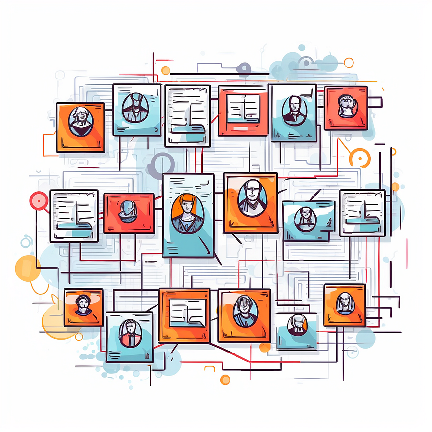

**Knowledge Graphs & LLMs: Multi-Hop Question Answering**

Retrieve information that spans across multiple documents

*third blog post of Neo4j's NaLLM project. We started this project to
explore, develop, and showcase practical uses of these [[LLMs in
conjunction with
Neo4j]{.underline}](https://neo4j.com/generativeai/?utm_campaign=gen-ai&utm_content=medium&utm_source=blog).
As part of this project, we will construct and publicly display
demonstrations in a [[GitHub
repository]{.underline}](https://github.com/neo4j/NaLLM), providing an
open space for our community to observe, learn, and contribute.
Additionally, we have been writing about our findings in blog posts. You
can see the previous two blog posts here:*

-   [[Harnessing LLMs With
    Neo4j]{.underline}](https://medium.com/neo4j/harnessing-large-language-models-with-neo4j-306ccbdd2867)

-   [[Fine-Tuning vs Retrieval-Augmented
    Generation]{.underline}](https://medium.com/neo4j/knowledge-graphs-llms-fine-tuning-vs-retrieval-augmented-generation-30e875d63a35)

{width="6.268055555555556in"
height="6.268055555555556in"}

Midjourney's idea of an investigative board.

In the[[ previous blog
post]{.underline}](https://medium.com/neo4j/knowledge-graphs-llms-fine-tuning-vs-retrieval-augmented-generation-30e875d63a35),
we learned about the retrieval-augmented approach to overcome the
limitations of Large Language Models (LLMs), such as hallucinations and
limited knowledge. The idea behind the retrieval-augmented approach is
to reference external data at question time and feed it to an LLM to
enhance its ability to generate accurate and relevant answers.

{width="6.268055555555556in"
height="3.1305555555555555in"}

Retrieval-augmented approach to LLM applications. Image by author.

When a user asks a question, an intelligent search tool looks for
relevant information in the provided Knowledge bases. For example, you
might have encountered instances of searching for relevant information
within PDFs or a company's documentation. Most of those examples use
vector similarity search to identify which chunks of text might contain
relevant data to answer the user's question accurately. The
implementation is relatively straightforward.

{width="6.268055555555556in"
height="3.825in"}

RAG applications using vector similarity search. Image by author.

The PDFs or the documentation are first split into multiple chunks of
text. Some different strategies include how large the text chunks should
be and if there should be any overlap between them. In the next step,
vector representations of text chunks are generated by using any of the
available text embedding models. That is all the preprocessing needed to
perform a vector similarity search at query time. The only step left is
to encode the user input as a vector at query time and use cosine or any
other similarity to compare the distance between the user input and the
embedded text chunks. Most frequently, you will see that the top three
most similar documents are returned to provide the context to the LLM to
enhance its capability to generate accurate answers. This approach works
fairly well when the vector search can produce relevant chunks of text.

However, simple vector similarity search might not be sufficient when
the LLM needs information from multiple documents or even just multiple
chunks to generate an answer.

For example, consider the following question:

*Did any of the former OpenAI employees start their own company?*

If you think about it, this question can be broken down into two
questions.

-   Who are the former employees of OpenAI?

-   Did any of them start their own company?

{width="4.65in"
height="4.125in"}

Information spanning across multiple documents. Image by author.

Answering these types of questions is a **multi-hop question-answering
task**, where a single question can be broken down into multiple
sub-questions and can require numerous documents to be provided to the
LLM to generate an accurate answer.

The above-mentioned workflow of simply chunking and embeddings documents
in a database and then using plain vector similarity search might
struggle with multi-hop questions due to:

-   **Repeated information in top N documents**: The provided documents
    are not guaranteed to contain complementary and complete information
    needed to answer a question. For example, the top three similar
    documents might all mention that *Shariq* worked at *OpenAI* and
    possibly founded a company while completely ignoring all the other
    former employees that became founders

-   **Missing reference information: **Depending on the chunk sizes, you
    might lose the reference to the entities in the documents. This can
    be partially solved by chunk overlaps. However, there are also
    examples where the references point to another document, so some
    sort of co-reference resolution or other preprocessing would be
    needed.

-   **Hard to define ideal N number of retrieved documents**: Some
    questions require more documents to be provided to an LLM to
    accurately answer the question, while in other situations, a large
    number of provided documents would only increase the noise (and
    cost).

{width="6.268055555555556in"
height="3.9256944444444444in"}

An example where the similarity search might return some duplicated
information, while other relevant information could be ignored due to a
low K number of retrieved information or embedding distance. Image by
the author.

Therefore, a plain vector similarity search might struggle with
multi-hop questions. However, we can employ multiple strategies to
attempt to answer multi-hop questions requiring information from various
documents.

**Knowledge Graph as Condensed Information Storage**

If you are paying close attention to the LLM space, you might have come
across the idea of using various techniques to condense information for
it to be more easily accessible during query time. For example,
you [[could use an LLM to provide a summary of
documents]{.underline}](https://medium.com/google-cloud/how-to-use-llms-to-generate-concise-summaries-of-text-a04966659ed) and
then embed and store the summaries instead of the actual documents.
Using this approach, you could remove a lot of noise, get better
results, and worry less about prompt token space.

Interestingly, you could conduct the contextual summarization at
ingestion or [[perform it during the query
time]{.underline}](https://blog.langchain.dev/improving-document-retrieval-with-contextual-compression/).
Contextual compression during query time is interesting as the context
is picked that is relevant to the provided question, so it is a bit more
guided. However, the heavier the workload during the query time, the
worse the expected user latency will be. Therefore, it is recommended to
move as much of the workload to ingestion time as possible to improve
latency and avoid other runtime issues.

The same approach can be applied to [[summarize conversation
history]{.underline}](https://python.langchain.com/en/latest/modules/memory/types/summary_buffer.html) to
avoid running into *token limit problems*.

I haven't seen any articles about combining and summarizing multiple
documents as a single record. The problem is probably that there are too
many combinations of documents that we could merge and summarize.
Therefore, it is perhaps *too costly to process all the combinations* of
documents at ingestion time.\
However, a knowledge graph can help here too.

The process of extracting structured information in the form of entities
and relationships from unstructured text has been around for some time
and is better known as [[the information extraction
pipeline]{.underline}](https://towardsdatascience.com/extract-knowledge-from-text-end-to-end-information-extraction-pipeline-with-spacy-and-neo4j-502b2b1e0754).
The beauty of combining an information extraction pipeline with
knowledge graphs is that you can process each document individually, and
the information from different records gets connected when the knowledge
graph is constructed or enriched.

{width="6.268055555555556in"
height="4.863888888888889in"}

Extracting entities and relationships from text to construct a knowledge
graph. Image by author.

The knowledge graph used nodes and relationships to represent data. In
this example, the first document provided the information
that *Dario* and *Daniela* used to work at *OpenAI*, while the second
document offered information about their *Anthropic* startup. Each
record was processed individually, yet ***the knowledge graph
representation connects the data*** and makes it easy to answer
questions spanning across multiple documents.

Most of the newer approaches using LLMs to answer multi-hop questions we
encountered focus on solving the task at query time. However, we believe
that many multi-hop question-answering issues can be solved by
preprocessing data before ingestion and connecting it in a knowledge
graph. The information extraction pipeline can be [[performed using
LLMs]{.underline}](https://medium.com/neo4j/creating-a-knowledge-graph-from-video-transcripts-with-gpt-4-52d7c7b9f32c) or [[custom
text domain
models]{.underline}](https://medium.com/neo4j/monitoring-the-cryptocurrency-space-with-nlp-and-knowledge-graphs-92a1cfaebd1a).

In order to retrieve information from the knowledge graph at query time,
we have to construct an appropriate Cypher statement. Luckily, LLMs are
pretty good at translating natural language to Cypher graph-query
language.

{width="6.268055555555556in"
height="3.1305555555555555in"}

Using knowledge graphs as part of retrieval-augmented LLM applications.
Image by author.

In this example, the smart search uses an LLM to generate an appropriate
Cypher statement to retrieve relevant information from a knowledge
graph. The relevant information is then passed to another LLM call,
which uses the original question and the provided information to
generate an answer. In practice, you could use different LLMs for
generating Cypher statements and answers or use various prompts on a
single LLM.

**Combining Graph and Textual Data**

Sometimes, you might want to combine textual and graph data to find
relevant information. For example, consider the following question:

*What is the latest news about Prosper Robotics founders?*

In this example, you might want to identify the Prosper Robotics
founders using the knowledge graph structure and retrieve the latest
articles mentioning them.

{width="6.268055555555556in"
height="6.795833333333333in"}

Knowledge graph with explicit links between structured information and
unstructured text. Image by author.

To answer the question about the latest news about Prosper Robotics
founders, you would start from the Prosper Robotics node, traverse to
its founders, and then retrieve the latest articles mentioning them.

A knowledge graph can be used to represent structured information about
entities and their relationships, as well as unstructured text as node
properties. Additionally, you could employ natural language techniques
like named entity recognition to connect unstructured information to
relevant entities in the knowledge graph, as shown with
the **MENTIONS** relationship.

We believe that the future of retrieval-augmented generation
applications is utilizing both structured and unstructured information
to generate accurate answers. Therefore, a knowledge graph is a perfect
solution because you can store both structured and unstructured data and
connect them with explicit relationships, making information more
accessible and easier to find.

{width="6.268055555555556in"
height="3.1875in"}

Using Cypher and vector similarity search to retrieve relevant
information from a knowledge graph. Image by author.

When the knowledge graph contains structured and unstructured data, the
smart search tool could utilize Cypher queries or vector similarity
search to retrieve relevant information. In some cases, you could also
use a combination of the two. For example, you could start with a Cypher
query to identify relevant documents and then use vector similarity
search to find specific information within those documents.

**Using Knowledge Graphs in Chain-of-Thought Flow**

Another very exciting development around LLMs is the
so-called [[chain-of-thought question
answering]{.underline}](https://cobusgreyling.medium.com/chain-of-thought-prompting-llm-reasoning-147a6cdb312b),
especially with [[LLM
agents]{.underline}](https://python.langchain.com/en/latest/modules/agents.html).
The idea behind LLM agents is that they can decompose questions into
multiple steps, define a plan, and use any of the provided tools. In
most cases, the agent tools are APIs or knowledge bases that the agent
can access to retrieve additional information. Let's again consider the
following question:

*What is the latest news about Prosper Robotics founders?*

{width="6.268055555555556in"
height="6.801388888888889in"}

No explicit links between knowledge graph entities and unstructured
text. Image by author.

Suppose you don't have explicit connections between articles and
entities they mention. The articles and entities could even be in
separate databases. In this case, an LLM agent using chain-of-thought
flow would be very helpful. First, the agent would decompose the
question into sub-questions.

-   Who are the founders of Prosper Robotics?

-   What is the latest news about them?

Now, an agent could decide which tool to use. Suppose we provide it with
a knowledge graph access that it can use to retrieve structured
information. Therefore, an agent could choose to retrieve the
information about the founders of Prosper Robotics from a knowledge
graph. As we already know, the founder of Prosper Robotics is Shariq
Hashme. Now that the first question was answered, the agent could
rewrite the second subquestion as:

-   What is the latest news about Shariq Hashme?

The agent could use any of the available tools to answer the subsequent
question. The tools can range from knowledge graphs, document or vector
databases, various APIs, and more. Having access to structured
information allows LLM applications to perform various analytics
workflows where aggregation, filtering, or sorting is required. Consider
the following questions:

-   Which company with a solo founder has the highest valuation?

-   Who founded the most companies?

Plain vector similarity search can struggle with these types of
analytical questions since it searches through unstructured text data,
making it hard to sort or aggregate data. Therefore, a combination of
structured and unstructured data is probably the future of
retrieval-augmented LLM applications. Additionally, as we have seen,
knowledge graphs are also ideal for representing connected information
and, consequently, multi-hop queries.

While the chain-of-thought is a fascinating development around LLMs as
it shows how an LLM can reason, it is not the most user-friendly as the
response latency can be high due to multiple LLM calls. However, we are
still very excited to understand more about incorporating knowledge
graphs into chain-of-thought flows for various use cases.

**Summary**

Retrieval-augmented generation applications often require retrieving
information from multiple sources to generate accurate answers. While
textual summarization can be challenging, representing information in a
graph format can offer several advantages.

By processing each document separately and connecting them in a
knowledge graph, we can construct a structured representation of the
information. This approach allows for easier traversal and navigation
through interconnected documents, enabling multi-hop reasoning to answer
complex queries. Furthermore, constructing the knowledge graph during
the ingestion phase reduces the workload during query time, resulting in
improved latency.

Another advantage of using a knowledge graph is its ability to store
both structured and unstructured information. This flexibility makes
a [[knowledge graphs
suitable]{.underline}](https://neo4j.com/generativeai/?utm_campaign=gen-ai&utm_content=medium&utm_source=blog) for
a wide range of language model (LLM) applications, as it can handle
various data types and relationships between entities. The graph
structure provides a visual representation of the knowledge,
facilitating transparency and interpretability for both developers and
users.

Overall, leveraging knowledge graphs in retrieval-augmented generation
applications offers benefits such as improved query efficiency,
multi-hop reasoning capabilities, and support for structured and
unstructured information.

Keep an eye out for updates from our team as we progress the development
of this project, all of which will be openly documented on our [[GitHub
repository]{.underline}](https://github.com/neo4j/NaLLM).

**GitHub - neo4j/NaLLM: Repository for the NaLLM project**

Repository for the NaLLM project. Contribute to neo4j/NaLLM development
by creating an account on GitHub.

github.com
